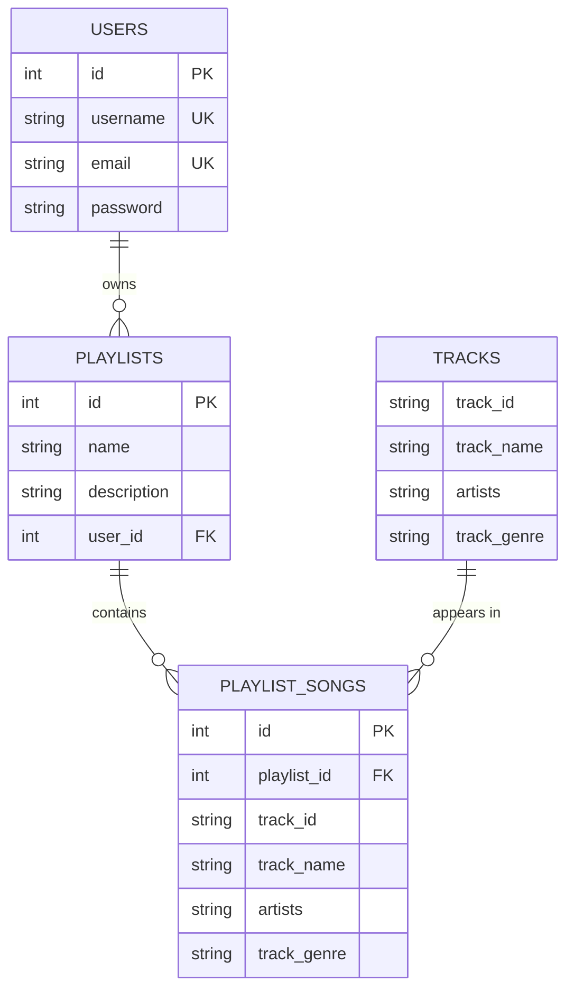

# Rhythmix
 
A music playlist web app. Users can create an account, search a Spotify tracks dataset by title, artist, or genre, and build their own playlists.
 
**Tech stack:** Python · Flask · SQLite · SQLAlchemy · pandas · Jinja2 · HTML/CSS/JavaScript
 
## Features
 
- **User accounts:** register, log in, and log out with session-based authentication
- **Track search:** find songs by title or artist, or filter by genre
- **Playlists:** create playlists with a name and description, then add songs from search results
- **Account page:** view all of your playlists and the songs in each one
## Database Design
 
Track data comes from the [Spotify Tracks Dataset](https://www.kaggle.com/datasets/maharshipandya/-spotify-tracks-dataset) on Kaggle and is loaded into SQLite with pandas. User data is stored in three related tables, with a join table linking playlists to tracks:
 

 
- Foreign keys use `ON DELETE CASCADE`, so deleting a user removes their playlists, and deleting a playlist removes its songs.
- All queries are parameterized to prevent SQL injection.
## Project Structure
 
```
backend/
  api.py           JSON REST API (used by testFront/)
  main.py          Server-rendered Flask app (used by frontend/)
  init_db.py       Creates the SQLite schema for main.py
  requirements.txt
  Dockerfile
frontend/
  templates/       Jinja2 templates: login, register, search, playlist, account
  static/          Stylesheet and SQLite database
testFront/         Static HTML/CSS/JS pages that call the JSON API
```
 
The project has two front ends that share the same data model: a server-rendered Flask/Jinja2 version (`main.py`) and a JavaScript front end that talks to a JSON API (`api.py`).
 
## Getting Started
 
### Prerequisites
 
- Python 3.11+
- A Kaggle account and API token to download the dataset. Set `KAGGLE_USERNAME` and `KAGGLE_KEY` as environment variables, or place `kaggle.json` in `~/.kaggle/`.
### Install
 
```bash
git clone https://github.com/FinleyClapper/DB-Managemnt-Term-Project.git
cd DB-Managemnt-Term-Project/backend
pip install -r requirements.txt flask-cors flask-sqlalchemy kagglehub
```
 
### Option A: JSON API + JavaScript front end
 
```bash
# from backend/
python api.py                 # API runs at http://127.0.0.1:5000/api
```
 
In a second terminal, serve the front end on port 5500 (the port the API allows for CORS):
 
```bash
cd testFront
python -m http.server 5500
```
 
Then open <http://127.0.0.1:5500/index/index.html>.
 
### Option B: Server-rendered Flask app
 
```bash
# from the repository root
python backend/init_db.py     # creates frontend/static/rhythmix.db
cd backend
python main.py                # app runs at http://127.0.0.1:5000
```
 
## API Reference
 
| Endpoint | Method | Description |
|---|---|---|
| `/api/auth/signup` | GET | Create an account (`user`, `email`, `pswrd`) |
| `/api/auth/login` | GET | Log in (`user`, `pswrd`) |
| `/api/auth/me` | GET | Get the logged-in user |
| `/api/auth/logout` | POST | Log out |
| `/api/search/title` | GET | Search tracks by title (`title`) |
| `/api/search/artist` | GET | Search tracks by artist (`artist`) |
| `/api/search/genre` | GET | Search tracks by genre (`genre`) |
| `/api/search/track_id` | GET | Look up a track (`id`) |
| `/api/playlist/create` | GET | Create a playlist (`name`, `description`) |
| `/api/playlist/fetch` | GET | List the user's playlists |
| `/api/playlist/fetch/id` | GET | Get one playlist (`id`) |
| `/api/playlist/fetch/songs/id` | GET | List songs in a playlist (`id`) |
| `/api/playlist/add` | GET | Add a song to a playlist |
 
## Known Limitations and Next Steps
 
A few things would need work before production use:
 
- Move login and signup to `POST` requests so credentials are not sent in the URL
- Add bcrypt password hashing to the JSON API (the Flask app already uses it)
- Load the Flask secret key from an environment variable instead of hardcoding it
- Bring the `main.py` schema in line with `api.py` (`init_db.py` is missing the playlist `description` column)
- Finish the edit and delete playlist routes
## Team
 
- Sebastian Shumate
- Finley Clapper
- Lanre Ayegbusi
